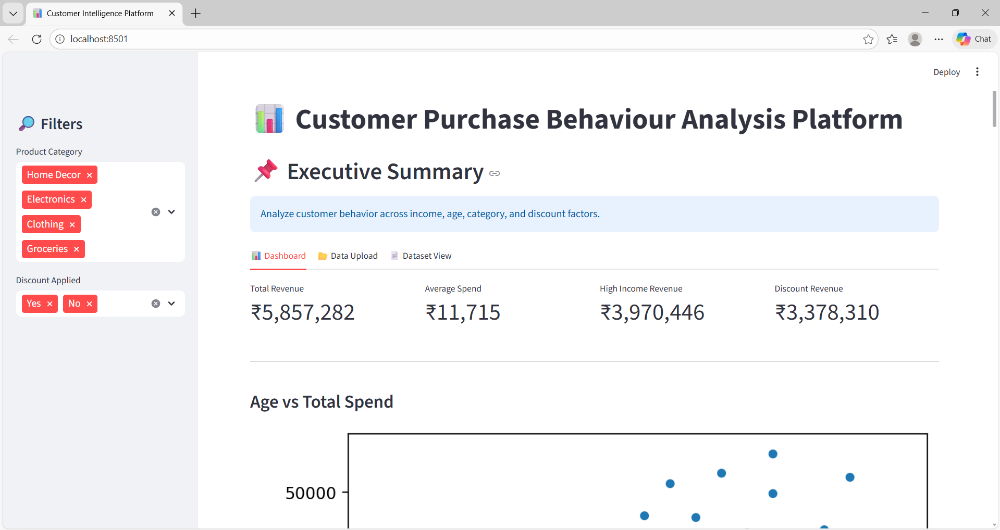
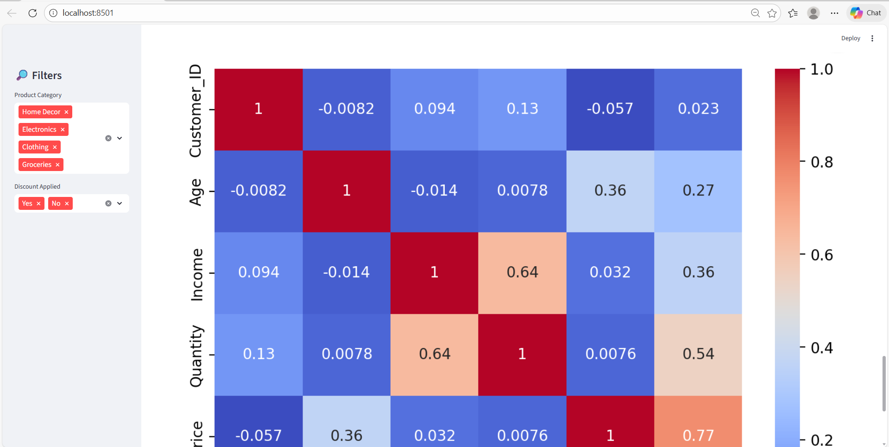
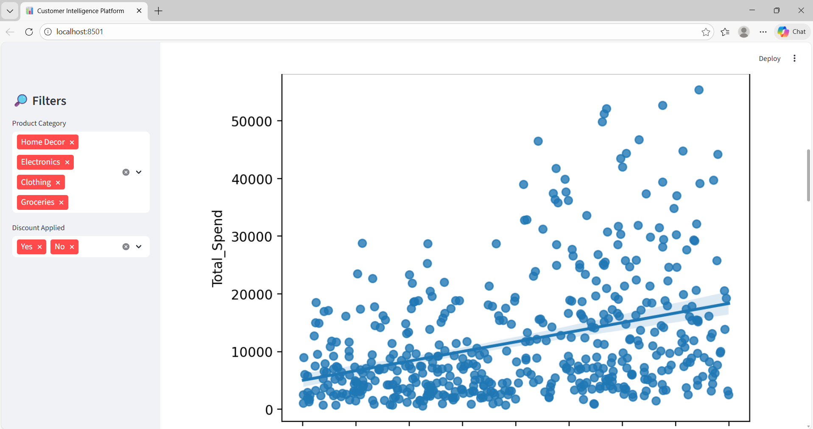

# 📊 Customer Purchase Behaviour Analysis Platform


An interactive Business Intelligence dashboard built using **Python & Streamlit** to analyze customer purchase behavior through dynamic filtering, KPI metrics, and data visualizations.

## 🌐 Live Demo

👉 https://customer-purchase-behaviour-analysis-platform.streamlit.app/

## 🚀 Project Overview

This platform helps analyze customer spending patterns based on:

- Age
- Income
- Product Category
- Discount Application

It provides actionable insights for revenue optimization and customer segmentation.


## 📸 Dashboard Preview

### 🔹 Main Dashboard


### 🔹 Correlation Heatmap


### 🔹 Filters & Controls


---

## 🔥 Features

- 📈 Interactive Dashboard
- 📊 KPI Metrics (Revenue, Avg Spend, High Income Revenue, Discount Revenue)
- 🔎 Sidebar Filters (Product Category & Discount)
- 📉 Income vs Spend Regression Analysis
- 📦 Revenue by Product Category
- 💰 Discount Impact Boxplot
- 🔥 Correlation Heatmap
- 📂 CSV Drag-and-Drop Upload
- 📄 Full Dataset View Tab

---

## 🛠 Tech Stack

- Python
- Streamlit
- Pandas
- Seaborn
- Matplotlib

---

## 📂 Project Structure

```
Customer_Purchase_Analysis/
│
├── app.py
├── requirements.txt
├── data/
│   └── customer_data.csv
└── README.md
```

---

## ▶️ How To Run Locally

1️⃣ Clone the repository:

```
git clone https://github.com/miishthiii/Customer-Purchase-Behaviour-Analysis-Platform.git
```

2️⃣ Navigate into the folder:

```
cd Customer-Purchase-Behaviour-Analysis-Platform
```

3️⃣ Install dependencies:

```
pip install -r requirements.txt
```

4️⃣ Run the app:

```
streamlit run app.py
```

---

## 📊 Key Insights Derived

- High-income customers contribute significantly to revenue.
- Discount strategies influence customer spending behavior.
- Certain product categories dominate revenue generation.
- Income shows a positive correlation with total spend.

---

## 🔮 Future Improvements

- AI-powered insights assistant
- Customer segmentation (K-Means / RFM Analysis)
- PDF export reports
- Cloud deployment
- Authentication system

---

## 👩‍💻 Author

Developed as part of a data analytics project to demonstrate business intelligence and exploratory data analysis skills.
